ggfunction
================

<!-- README.md is generated from README.Rmd. Please edit that file -->

<!-- badges: start -->

<!-- badges: end -->

**ggfunction** extends [**ggplot2**](https://ggplot2.tidyverse.org/)
with geoms and stats for plotting mathematical functions and probability
distributions directly from function objects. Supply a function and a
domain; **ggfunction** handles evaluation, rendering, and shading.

## Overview

The package is organized around two families of geoms:

| Family | Geom | Maps | Description |
|----|----|----|----|
| **Dimensional** | `geom_function_1d_1d()` | $\mathbb{R} \to \mathbb{R}$ | Scalar functions with optional interval shading |
|  | `geom_function_1d_2d()` | $\mathbb{R} \to \mathbb{R}^2$ | Parametric curves |
|  | `geom_function_2d_1d()` | $\mathbb{R}^2 \to \mathbb{R}$ | Scalar fields (raster, contour, filled contour) |
|  | `geom_function_2d_2d()` | $\mathbb{R}^2 \to \mathbb{R}^2$ | Vector field streamlines |
| **Probability** | `geom_pdf()` |  | Probability density function |
|  | `geom_cdf()` |  | Cumulative distribution function |
|  | `geom_pmf()` |  | Probability mass function (lollipop) |
|  | `geom_qf()` |  | Quantile function |
|  | `geom_cdf_discrete()` |  | Discrete CDF (step function) |
|  | `geom_qf_discrete()` |  | Discrete quantile function (step function) |
|  | `geom_survival_discrete()` |  | Discrete survival function $S(x) = 1 - F(x)$ (step function) |
|  | `geom_survival()` |  | Survival function $S(x) = 1 - F(x)$ |
|  | `geom_hf()` |  | Hazard function $h(x) = f(x)/S(x)$ |

## Dimensional Taxonomy

### Scalar functions: `geom_function_1d_1d()`

`geom_function_1d_1d()` evaluates a function
$f\colon \mathbb{R} \to \mathbb{R}$ at `n` equally-spaced points over
`xlim` and draws it as a curve, extending `ggplot2::stat_function()`
with built-in region shading. The following example plots the sine
function over one full period.

``` r
library("ggfunction")

ggplot() +
  geom_function_1d_1d(fun = sin, xlim = c(0, 2*pi))
```

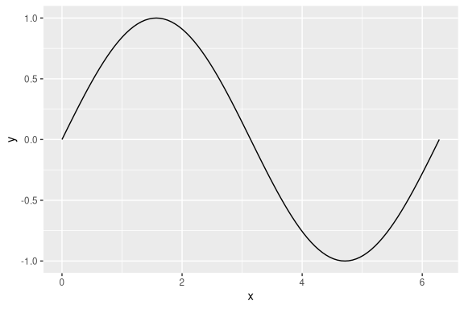

**Shading intervals.** The `shade_from` and `shade_to` parameters fill
the region between the curve and the $x$-axis over a specified interval.
Here we shade the standard normal density between $-1$ and $1$,
corresponding to approximately 68% of the total area.

``` r
ggplot() +
  geom_function_1d_1d(fun = sin, xlim = c(-3, 3), shade_from = -1, shade_to = 1)
```

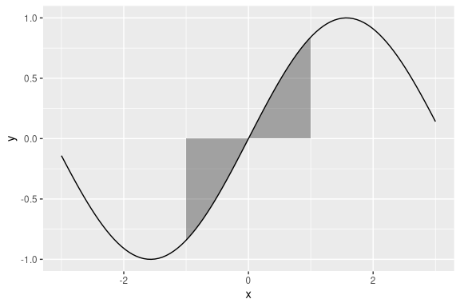

### Parametric curves: `geom_function_1d_2d()`

`geom_function_1d_2d()` evaluates a parametric curve
$\boldsymbol{\gamma}(t) = (x(t),\, y(t))$ over the range `tlim` with
step size `dt`, coloring the path by the time parameter by default. The
following example traces a three-petal rose curve
$\boldsymbol{\gamma}(t) = (\cos(3t)\cos t,\, \cos(3t)\sin t)$ for
$t \in [0, \pi]$.

``` r
f <- function(t) c(cos(3*t)*cos(t), cos(3*t)*sin(t))

ggplot() +
  geom_function_1d_2d(fun = f, tlim = c(0, 2*pi))
```

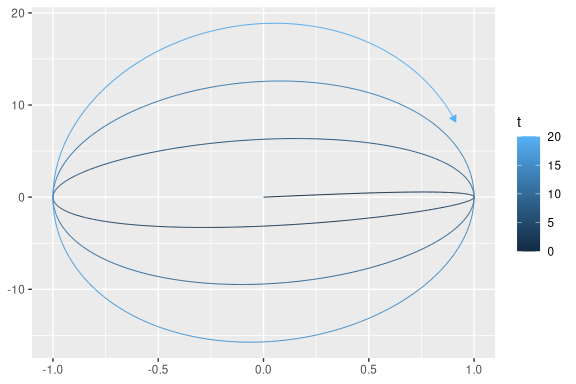

**Tail points.** Setting `tail_point = TRUE` marks the starting position
of the curve with a point, useful for showing an initial condition.

``` r
ggplot() +
  geom_function_1d_2d(fun = f, tlim = c(0, pi), tail_point = TRUE)
```

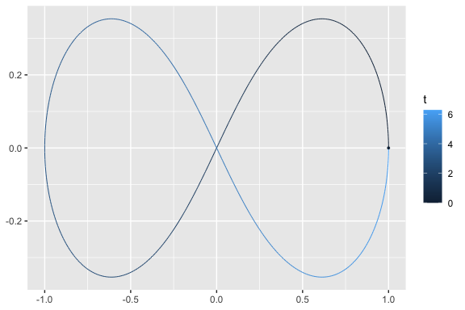

**Parameterized families.** Extra parameters for `fun` are passed via
`args`. The following example traces a Lissajous figure, a closed curve
that results when two sinusoids with a rational frequency ratio are
combined.

``` r
lissajous <- function(t, a = 3, b = 2, delta = pi/2) {
  c(sin(a * t + delta), sin(b * t))
}

ggplot() +
  geom_function_1d_2d(
    fun = lissajous, tlim = c(0, 2 * pi),
    args = list(a = 3, b = 2, delta = pi/2)
  )
```

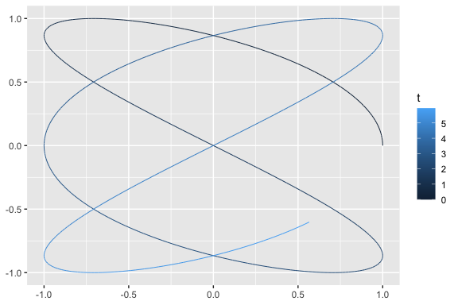

**Adding arrowheads.** Pass a `grid::arrow()` specification to add an
arrowhead indicating direction of travel along the curve.

``` r
ggplot() +
  geom_function_1d_2d(
    fun = f, tlim = c(0, pi),
    arrow = grid::arrow(angle = 30, length = grid::unit(0.02, "npc"), type = "closed")
  )
```

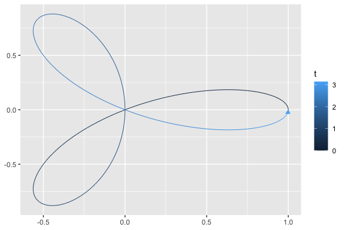

### Scalar fields: `geom_function_2d_1d()`

`geom_function_2d_1d()` evaluates a scalar field
$f\colon \mathbb{R}^2 \to \mathbb{R}$ on an $n \times n$ grid over
`xlim` $\times$ `ylim`. The function must accept a numeric vector of
length 2 and return a scalar; extracting components with
`x <- v[1]; y <- v[2]` is the recommended pattern. The example below
shows a Gaussian bump $f(x,y) = \exp\!\bigl(-(x^2+y^2)/2\bigr)$ rendered
as a raster heatmap (the default `type`).

``` r
f <- function(v) {
  x <- v[1]; y <- v[2]
  sin(2*pi*x) + sin(2*pi*y)
}

ggplot() +
  geom_function_2d_1d(fun = f, xlim = c(-1, 1), ylim = c(-1, 1))
```

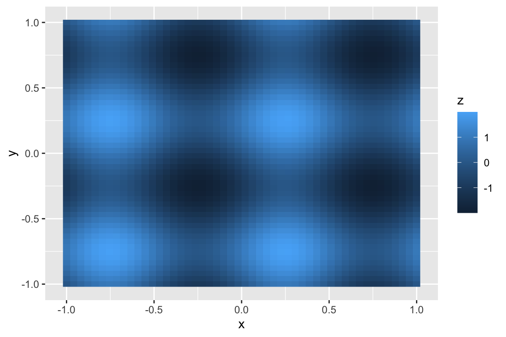

**Contour modes.** The `type` argument switches among three visual
encodings of the same field. `"contour"` draws iso-level curves and
`"contour_filled"` draws filled regions between levels; both are
rendered using **ggplot2**’s contour infrastructure so they respond to
`bins`, `binwidth`, and `breaks`.

``` r
ggplot() +
  geom_function_2d_1d(fun = f, xlim = c(-1, 1), ylim = c(-1, 1), type = "contour")
```

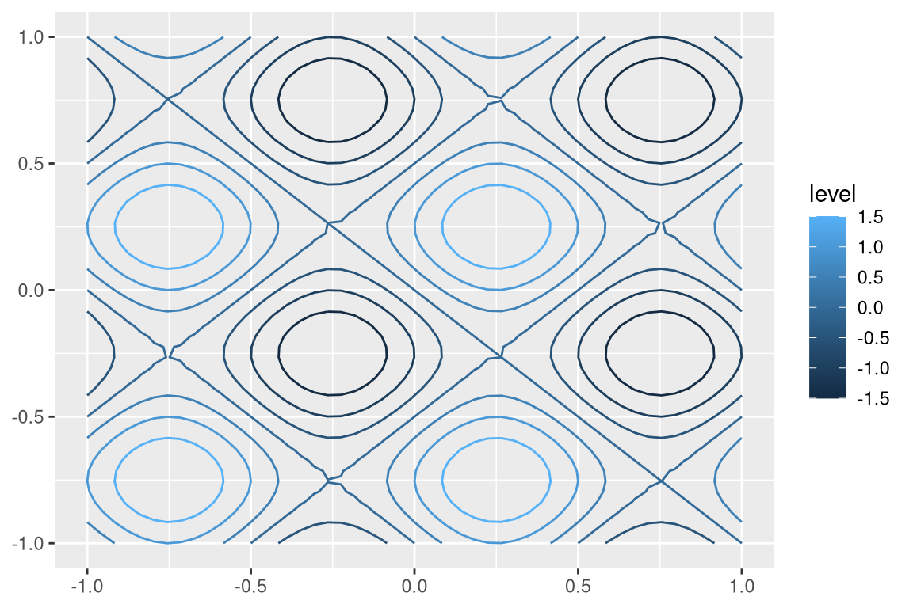

``` r
ggplot() +
  geom_function_2d_1d(fun = f, xlim = c(-1, 1), ylim = c(-1, 1), type = "contour_filled")
```

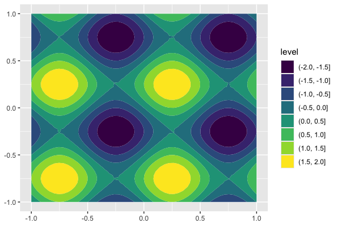

### Vector fields: `geom_function_2d_2d()`

`geom_function_2d_2d()` visualizes a vector field
$\mathbf{F}\colon \mathbb{R}^2 \to \mathbb{R}^2$ via
[**ggvfields**](https://github.com/dusty-turner/ggvfields). The function
should accept a length-2 vector and return a length-2 vector. By default
(`type = "vector"`) it draws short arrows at each grid point colored by
field magnitude; `type = "stream"` switches to integral-curve
streamlines. The following example shows the rotation field
$\mathbf{F}(x,y) = (-y,\, x)$.

``` r
f <- function(u) {
  x <- u[1]; y <- u[2]
  c(-y, x)
}

ggplot() +
  geom_function_2d_2d(fun = f, xlim = c(-1, 1), ylim = c(-1, 1))
```

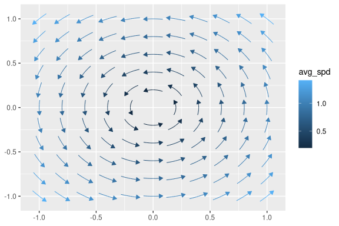

**Stream field.** Setting `type = "stream"` renders the field as
integral curves computed by numerical integration, colored by average
speed along each curve.

``` r
ggplot() +
  geom_function_2d_2d(fun = f, xlim = c(-1, 1), ylim = c(-1, 1), type = "stream")
```

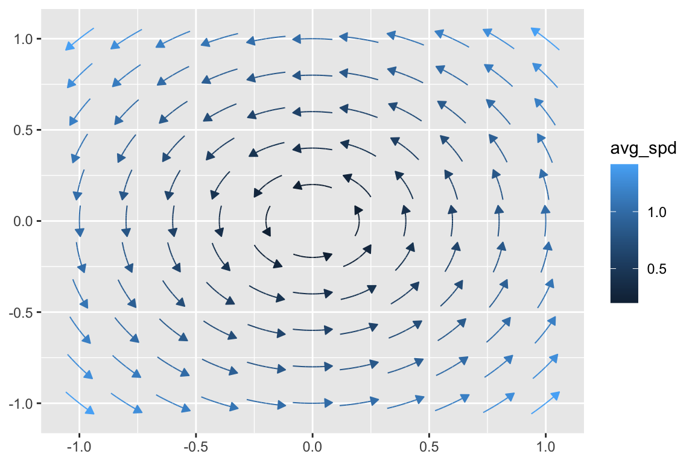

## Probability Distributions

The probability family provides a geom for each of the standard
functions associated with a distribution. Each accepts a plain R
function (e.g. `dnorm`, `pnorm`) and `xlim`; distribution parameters are
passed via `args`.

### PDF: `geom_pdf()`

`geom_pdf()` draws a probability density function as a filled area. It
validates that the supplied function integrates to 1 over `xlim`,
warning via [**cli**](https://cli.r-lib.org/) if it does not. The basic
call draws the full density with no shading.

``` r
ggplot() +
  geom_pdf(fun = dnorm, xlim = c(-3, 3))
```

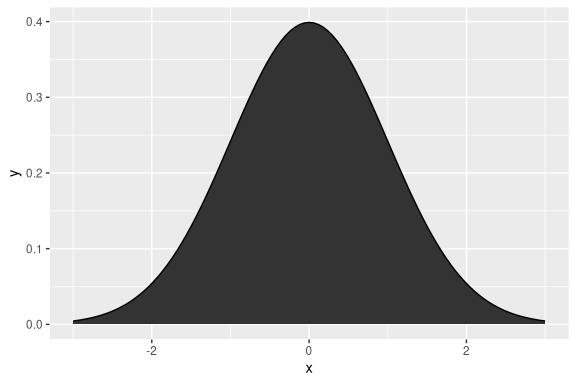

**Single threshold.** The `p` parameter shades from the left boundary up
to the $p$-quantile (`lower.tail = TRUE`, the default). Setting
`lower.tail = FALSE` shades the upper tail instead. Here we shade the
lower 97.5%.

``` r
ggplot() +
  geom_pdf(fun = dnorm, xlim = c(-3, 3), p = 0.975)
```

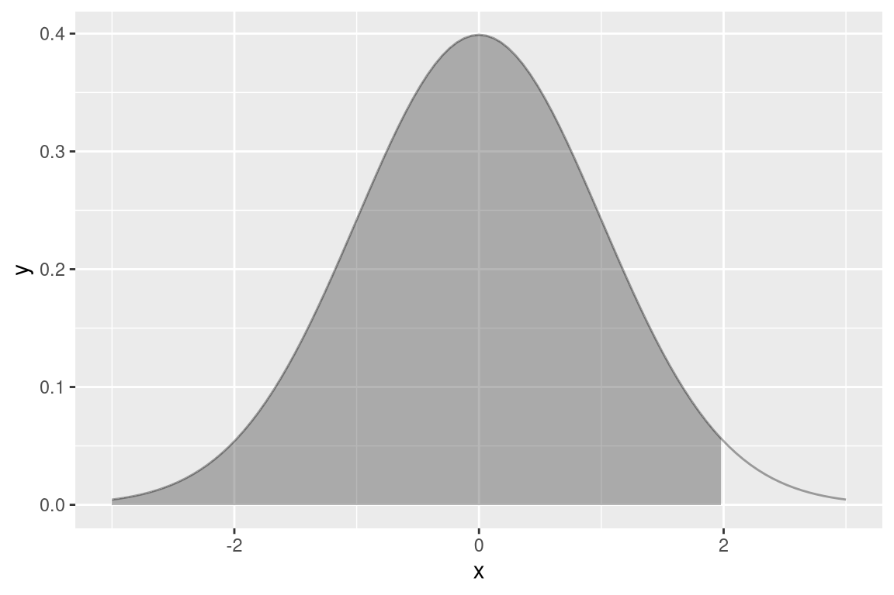

**Two-sided interval.** `p_lower` and `p_upper` together shade the
central region between two quantiles—the natural picture for a
confidence interval. The following example shades the central 95%.

``` r
ggplot() +
  geom_pdf(fun = dnorm, xlim = c(-3, 3), p_lower = 0.025, p_upper = 0.975)
```

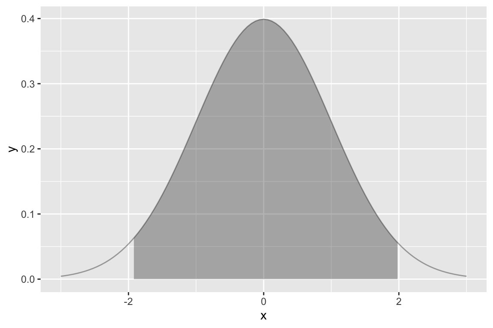

**Tail shading.** Setting `shade_outside = TRUE` inverts the two-sided
region, shading both tails. This is the rejection region of a two-sided
hypothesis test at level $\alpha = 0.05$.

``` r
ggplot() +
  geom_pdf(
    fun = dnorm, xlim = c(-3, 3),
    p_lower = 0.025, p_upper = 0.975, shade_outside = TRUE
  )
```

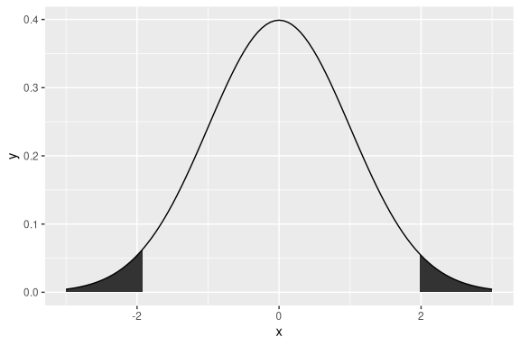

**Highest density region.** `shade_hdr` shades the smallest region of
the domain containing the specified probability mass—the [highest
density
region](https://en.wikipedia.org/wiki/Credible_interval#Highest_density_interval)
(HDR). For multimodal densities this region can be disconnected. The
following example uses an asymmetric mixture of two normals; the 80% HDR
captures both modes as two disjoint intervals, with more area allocated
to the taller, narrower component.

``` r
f_mix <- function(x) 0.6 * dnorm(x, mean = -2, sd = 0.6) + 0.4 * dnorm(x, mean = 2, sd = 1.2)
ggplot() +
  geom_pdf(fun = f_mix, xlim = c(-5, 6), shade_hdr = 0.8)
```

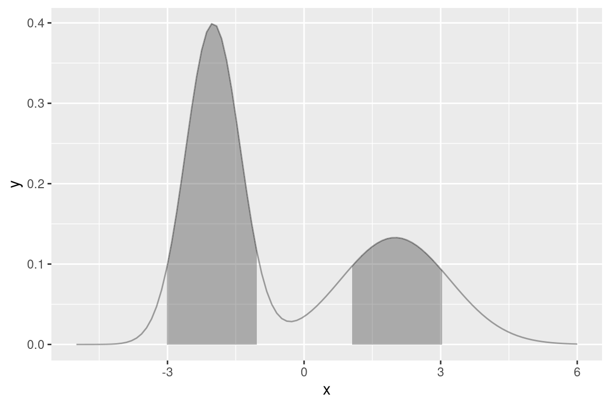

### PMF: `geom_pmf()`

`geom_pmf()` evaluates a probability mass function at each integer in
`xlim` and renders the result as a lollipop chart—vertical segments
capped with points. Distribution parameters are supplied via `args`. The
following example plots a $\text{Binomial}(10, 0.3)$ distribution.

``` r
ggplot() +
  geom_pmf(fun = dbinom, xlim = c(0, 10), args = list(size = 10, prob = 0.3))
```

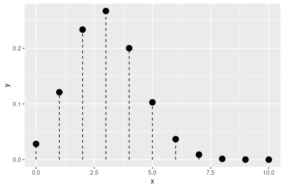

**Single threshold.** The `p` parameter shades lollipops up to the
$p$-quantile (grey dashed sticks mark the unshaded region). Here we
shade the lower 80% of a $\text{Binomial}(10, 0.5)$ distribution.

``` r
ggplot() +
  geom_pmf(fun = dbinom, xlim = c(0, 10), args = list(size = 10, prob = 0.5), p = 0.8)
```

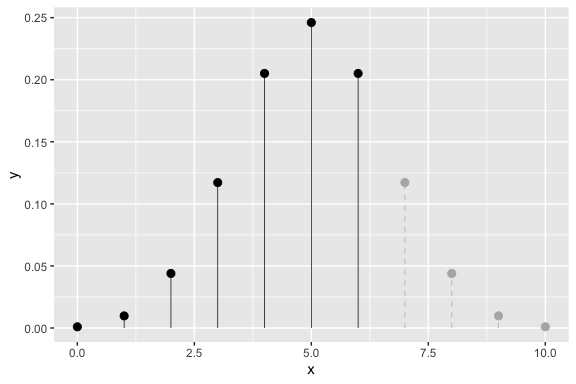

**Highest density region.** `shade_hdr` shades the smallest set of
support points whose total probability mass meets or exceeds the target
coverage. For a symmetric unimodal PMF this is a central interval; for a
skewed distribution it is asymmetric. Here the 70% HDR of a
$\text{Binomial}(10, 0.3)$ distribution is highlighted.

``` r
ggplot() +
  geom_pmf(fun = dbinom, xlim = c(0, 10), args = list(size = 10, prob = 0.3),
    shade_hdr = .70)
```

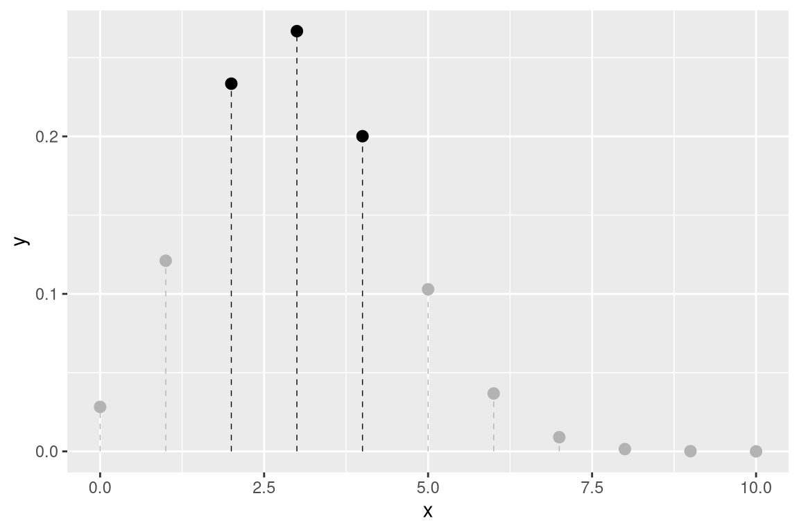

``` r
ggplot() +
  geom_pmf(fun = dbinom, xlim = c(0, 10), args = list(size = 10, prob = 0.3),
    shade_hdr = .80)
```

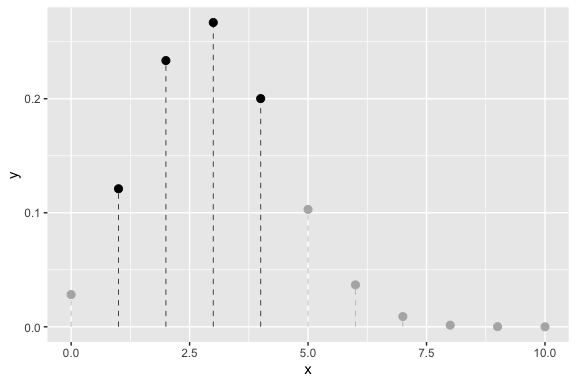

**Explicit support.** When the support is not a sequence of consecutive
integers, pass the exact support points via `support`. Here we plot the
distribution of the sample mean $\bar X$ of 10 iid
$\text{Bernoulli}(0.3)$ draws. The support is
$\{0, 0.1, 0.2, \ldots, 1\}$ and the PMF is binomial:
$P(\bar X = k/10) = \binom{10}{k}0.3^k 0.7^{10-k}$.

``` r
f_mean <- function(x, prob) dbinom(round(x * 10), size = 10, prob = prob)
ggplot() +
  geom_pmf(fun = f_mean, support = seq(0, 1, by = 0.1), args = list(prob = 0.3))
```

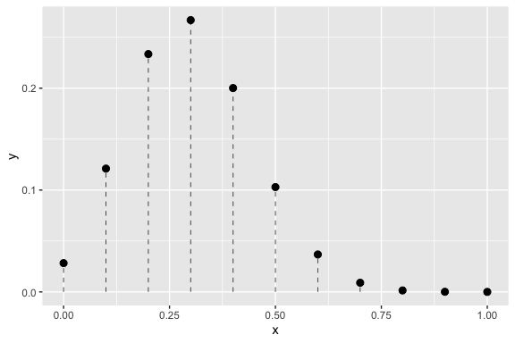

### CDF: `geom_cdf()`

`geom_cdf()` draws a cumulative distribution function as a line with
optional filled shading. It supports the same `p`, `lower.tail`,
`p_lower`, and `p_upper` arguments as `geom_pdf()`. Here we plot the
standard normal CDF, then shade the region below $p = 0.975$.

``` r
ggplot() +
  geom_cdf(fun = pnorm, xlim = c(-3, 3))
```

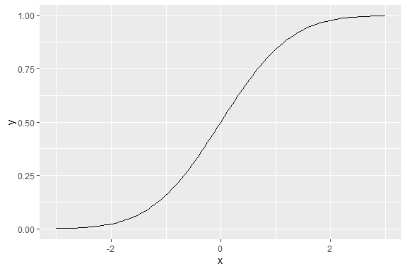

### Quantile function: `geom_qf()`

`geom_qf()` evaluates a quantile function $Q(p) = F^{-1}(p)$ over the
unit interval $(0, 1)$ and draws it as a curve. The following example
plots the standard normal quantile function.

``` r
ggplot() +
  geom_qf(fun = qnorm)
```

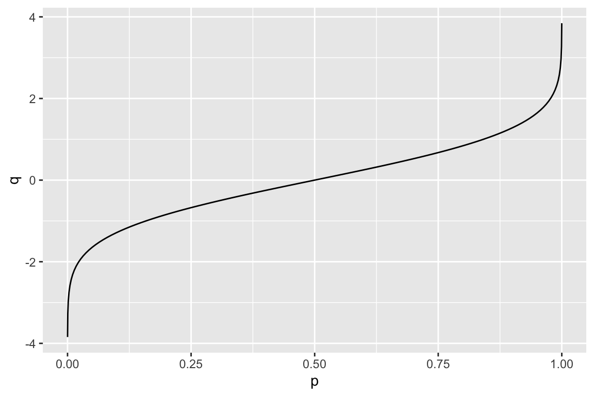

### Discrete CDF: `geom_cdf_discrete()`

`geom_cdf_discrete()` takes a PMF, accumulates it into the
right-continuous step-function CDF $F(x) = P(X \le x)$, and renders it
with horizontal segments, dashed vertical jumps at each mass point, open
circles at the lower limit of each jump, and closed circles at the
achieved value. The following example plots the
$\text{Binomial}(10, 0.5)$ CDF.

``` r
ggplot() +
  geom_cdf_discrete(fun = dbinom, xlim = c(0, 10), args = list(size = 10, prob = 0.5))
```

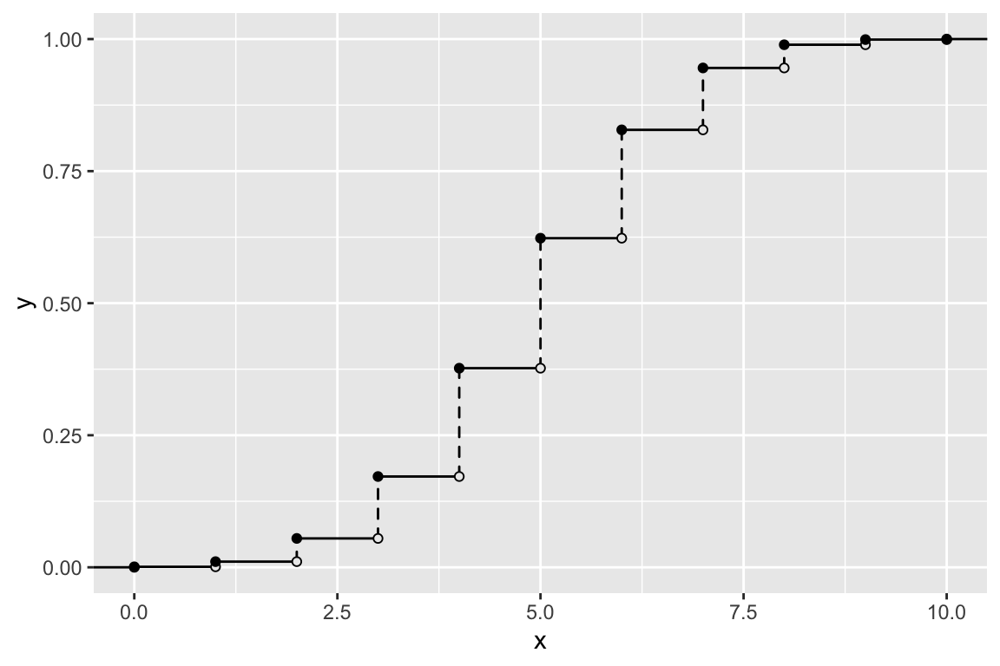

**Parameterized families.** Distribution parameters are passed via
`args`. Here we plot a $\text{Poisson}(5)$ CDF.

``` r
ggplot() +
  geom_cdf_discrete(fun = dpois, xlim = c(0, 15), args = list(lambda = 5))
```

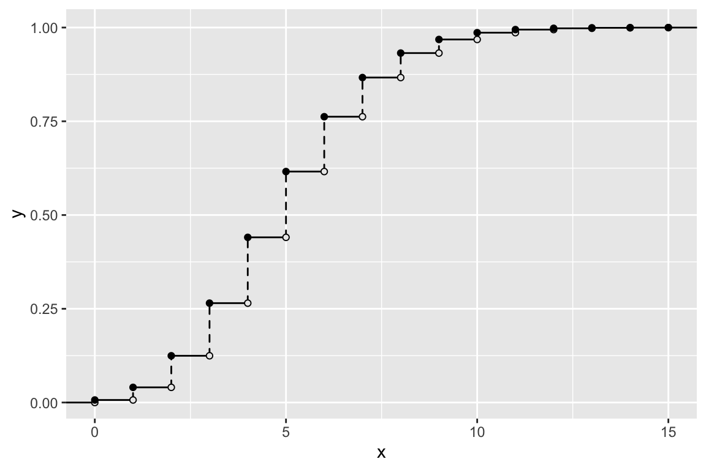

**Hiding points and lines.** Setting `show_points = FALSE` and
`show_vert = FALSE` removes the open and closed endpoint circles and/or
vertical lines, leaving only the horizontal lines.

``` r
ggplot() +
  geom_cdf_discrete(fun = dbinom, xlim = c(0, 10), args = list(size = 10, prob = 0.5),
    show_points = FALSE, show_vert = FALSE)
```

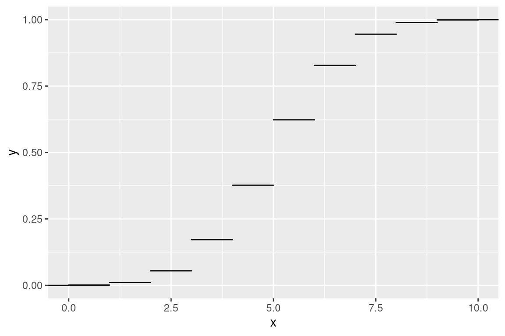

**Explicit support.** Pass non-integer support points directly via
`support`. Here we plot the CDF of the sample mean of 10 iid
$\text{Bernoulli}(0.3)$ draws.

``` r
f_mean <- function(x, prob) dbinom(round(x * 10), size = 10, prob = prob)
ggplot() +
  geom_cdf_discrete(fun = f_mean, support = seq(0, 1, by = 0.1), args = list(prob = 0.3))
```

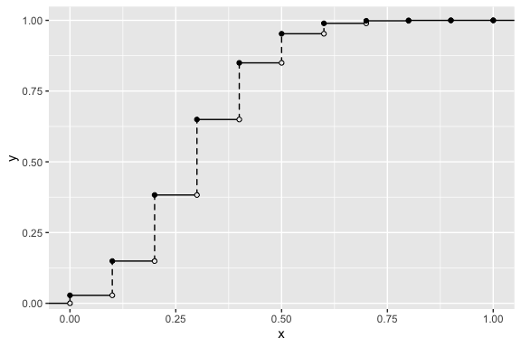

### Discrete quantile function: `geom_qf_discrete()`

`geom_qf_discrete()` takes a PMF and renders the quantile function
$Q(p) = \inf\{x : F(x) \ge p\}$ as a left-continuous step function on
the unit interval, with closed circles at the bottom of each jump (the
value is achieved) and open circles at the top (the next value is not
yet reached). The following example plots the $\text{Binomial}(10, 0.5)$
quantile function.

``` r
ggplot() +
  geom_qf_discrete(fun = dbinom, xlim = c(0, 10), args = list(size = 10, prob = 0.5))
```

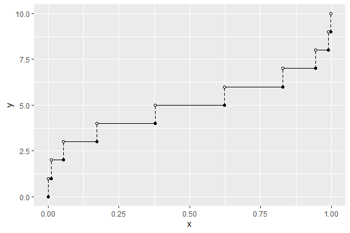

**Parameterized families.** Distribution parameters are passed via
`args`. Here we plot a $\text{Poisson}(5)$ quantile function.

``` r
ggplot() +
  geom_qf_discrete(fun = dpois, xlim = c(0, 15), args = list(lambda = 5))
```

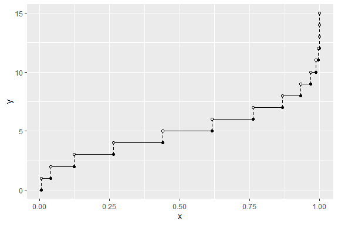

**Hiding points.** Setting `show_points = FALSE` removes the open and
closed endpoint circles, leaving only the horizontal and vertical lines.

``` r
ggplot() +
  geom_qf_discrete(fun = dbinom, xlim = c(0, 10), args = list(size = 10, prob = 0.5),
    show_points = FALSE)
```

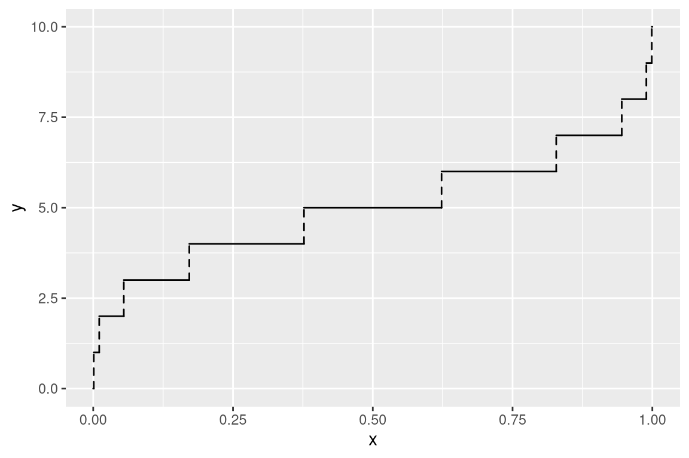

**Hiding vertical lines.** Setting `show_vert = FALSE` removes the
dashed vertical jump segments, leaving only the horizontal steps and
endpoint circles.

``` r
ggplot() +
  geom_qf_discrete(fun = dbinom, xlim = c(0, 10), args = list(size = 10, prob = 0.5),
    show_vert = FALSE)
```


**Explicit support.** The quantile function of the sample mean of 10 iid
$\text{Bernoulli}(0.3)$ draws.

``` r
f_mean <- function(x, prob) dbinom(round(x * 10), size = 10, prob = prob)
ggplot() +
  geom_qf_discrete(fun = f_mean, support = seq(0, 1, by = 0.1), args = list(prob = 0.3))
```

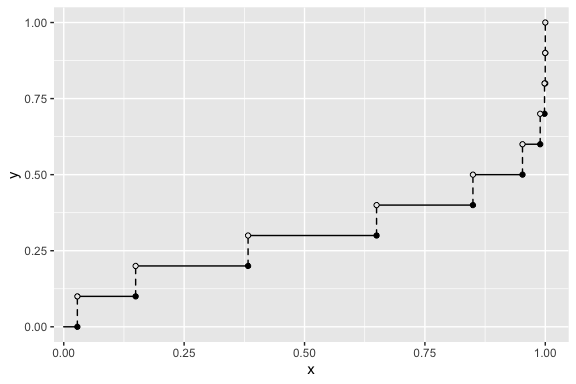

### Discrete survival function: `geom_survival_discrete()`

`geom_survival_discrete()` takes a PMF and renders the discrete survival
function $S(x) = 1 - F(x) = P(X > x)$ as a right-continuous step
function. It uses the same visual conventions as `geom_cdf_discrete()`:
horizontal segments, dashed vertical jumps, open circles at the pre-jump
value, and closed circles at the post-jump value. The following example
plots the $\text{Binomial}(10, 0.5)$ survival function.

``` r
ggplot() +
  geom_survival_discrete(fun = dbinom, xlim = c(0, 10), args = list(size = 10, prob = 0.5))
```

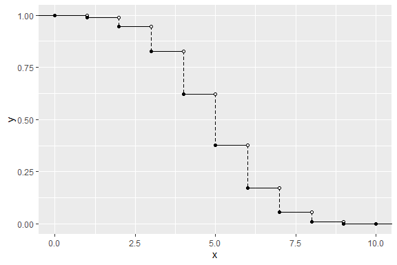

**Hiding points.** Setting `show_points = FALSE` removes the endpoint
circles.

``` r
ggplot() +
  geom_survival_discrete(fun = dbinom, xlim = c(0, 10), args = list(size = 10, prob = 0.5),
    show_points = FALSE)
```

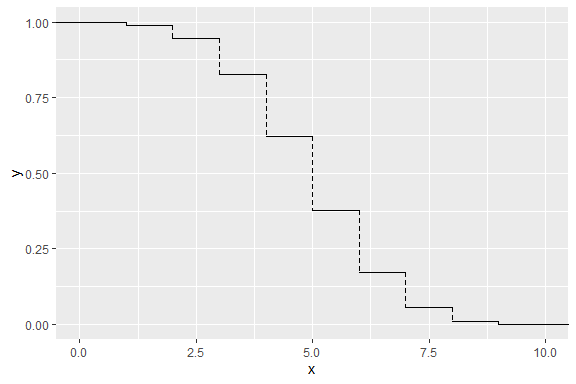

**Explicit support.** The survival function of the sample mean of 10 iid
$\text{Bernoulli}(0.3)$ draws.

``` r
f_mean <- function(x, prob) dbinom(round(x * 10), size = 10, prob = prob)
ggplot() +
  geom_survival_discrete(fun = f_mean, support = seq(0, 1, by = 0.1), args = list(prob = 0.3))
```

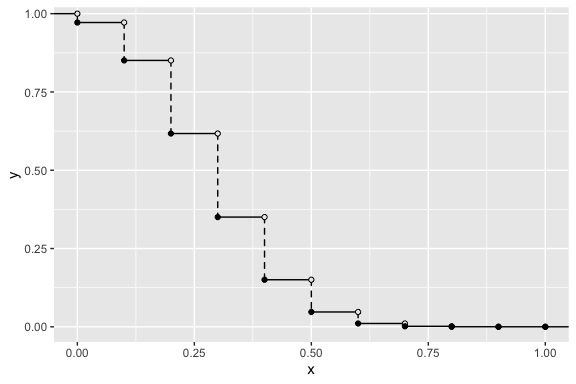

### Survival function: `geom_survival()`

`geom_survival()` plots $S(x) = 1 - F(x)$, the probability that the
event of interest has not yet occurred by time $x$. It accepts a CDF via
`fun`. The following example shows the survival function of an
$\text{Exponential}(0.5)$ distribution, which decays as
$S(x) = e^{-0.5x}$.

``` r
ggplot() +
  geom_survival(fun = pexp, xlim = c(0, 10), args = list(rate = 0.5))
```

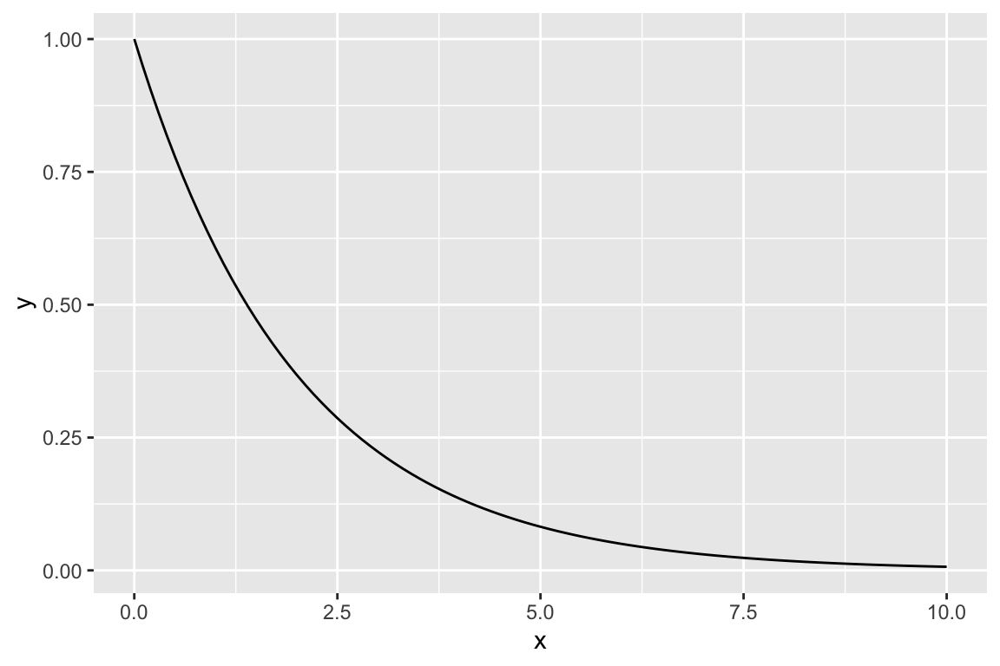

### Hazard function: `geom_hf()`

`geom_hf()` plots the hazard function $h(x) = f(x) / S(x)$, the
instantaneous rate of failure at time $x$ conditional on survival to
that point. It requires both a PDF (`pdf_fun`) and a CDF (`cdf_fun`).
Shared parameters go in `args`; use `pdf_args` and `cdf_args` for
overrides when the two functions have different parameterizations. The
exponential distribution’s constant hazard confirms the memoryless
property.

``` r
ggplot() +
  geom_hf(pdf_fun = dexp, cdf_fun = pexp, xlim = c(0.01, 10), args = list(rate = 0.5))
```

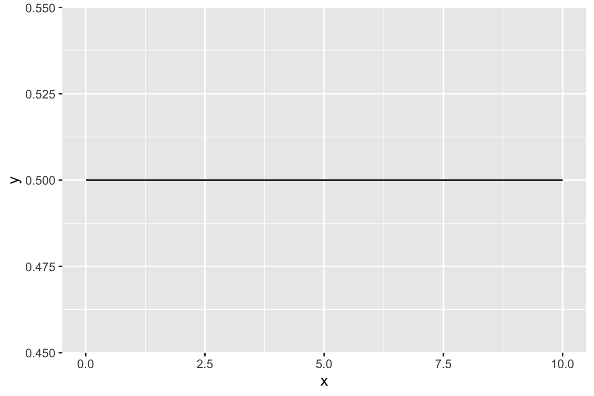

## Getting help

- Browse the [vignette](vignettes/ggfunction.Rmd) for a guided
  walkthrough
- File bugs or feature requests at
  <https://github.com/dusty-turner/ggfunction/issues>

## Installation

``` r
# install.packages("pak")
pak::pak("dusty-turner/ggfunction")
```
