ggfunction
================

# ggfunction

<!-- badges: start -->

<!-- badges: end -->

**ggfunction** extends [**ggplot2**](https://ggplot2.tidyverse.org/)
with geoms and stats for plotting mathematical functions. It also
provides more specialized geoms/stats for plotting *statistical*
functions related to probability distributions.

## Overview

The package is organized around two families of geoms:

| Family | Geom | Maps | Description |
|----|----|----|----|
| **Dimensional** | `geom_function_1d_1d()` | $\mathbb{R} \to \mathbb{R}$ | Scalar functions with optional interval shading |
|  | `geom_function_1d_2d()` | $\mathbb{R} \to \mathbb{R}^2$ | Parametric curves |
|  | `geom_function_2d_1d()` | $\mathbb{R}^2 \to \mathbb{R}$ | Scalar fields (raster, contour, filled contour) |
|  | `geom_function_2d_2d()` | $\mathbb{R}^2 \to \mathbb{R}^2$ | Vector field streamlines |
| **Probability** | `geom_pdf()` |  | Probability density function |
|  | `geom_cdf()` |  | Cumulative distribution function |
|  | `geom_pmf()` |  | Probability mass function (lollipop) |
|  | `geom_qf()` |  | Quantile function |
|  | `geom_discrete_cdf()` |  | Discrete CDF (step function) |
|  | `geom_survival()` |  | Survival function $S(x) = 1 - F(x)$ |
|  | `geom_hf()` |  | Hazard function $h(x) = f(x)/S(x)$ |

## Dimensional Taxonomy

### Scalar functions ($\mathbb{R} \to \mathbb{R}$)

At a basic level, `geom_function_1d_1d()` is essentially a
re-implementation of `ggplot2::geom_function()`:

``` r
library("ggfunction")
```

    ## Loading required package: ggplot2

``` r
ggplot() +
  geom_function_1d_1d(fun = sin, xlim = c(0, 2*pi))
```

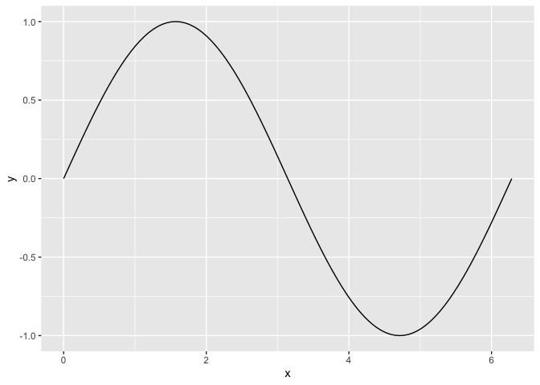<!-- -->

However, `geom_function_1d_1d()` also allows for shading to the $x$
axis:

``` r
ggplot() +
  geom_function_1d_1d(fun = sin, xlim = c(-3, 3), shade_from = -1, shade_to = 1)
```

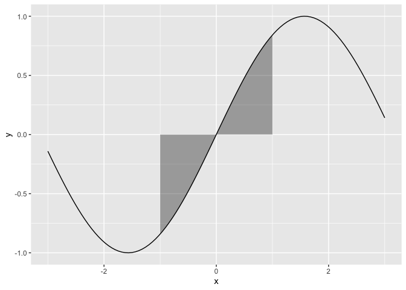<!-- -->

### Parametric curves ($\mathbb{R} \to \mathbb{R}^2$)

The graph of a function $\phi(t) = (x(t), y(t))$ is a curve in the plane
$\R^{2}$; these are *parametric* curves that operate over some range \$t

``` r
f <- function(t) c(sin(t), t * cos(t))
ggplot() +
  geom_function_1d_2d(fun = f, T = 20, tail_point = TRUE)
```

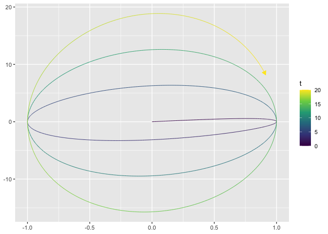<!-- -->

Tail points and arrow heads can be added with the respective arguments:

``` r
ggplot() +
  geom_function_1d_2d(fun = f, T = 20, tail_point = TRUE)
```

<!-- -->

### Scalar fields ($\mathbb{R}^2 \to \mathbb{R}$)

Visualize a scalar field as a raster, contour lines, or filled contours
using the `type` argument.

``` r
f <- function(v) exp(-(v[1]^2 + v[2]^2) / 2)

ggplot() +
  geom_function_2d_1d(fun = f, xlim = c(-3, 3), ylim = c(-3, 3))
```

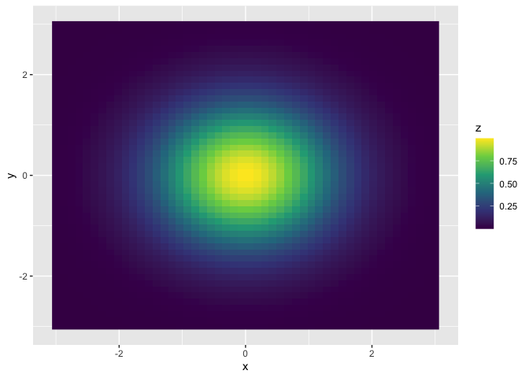<!-- -->

``` r
ggplot() +
  geom_function_2d_1d(fun = f, xlim = c(-3, 3), ylim = c(-3, 3), type = "contour")
```

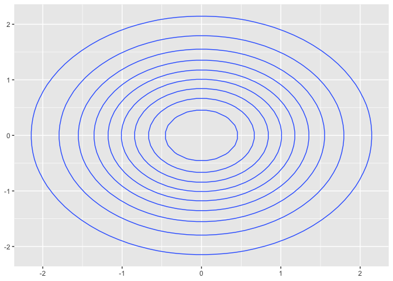<!-- -->

``` r
ggplot() +
  geom_function_2d_1d(fun = f, xlim = c(-3, 3), ylim = c(-3, 3), type = "contour_filled")
```

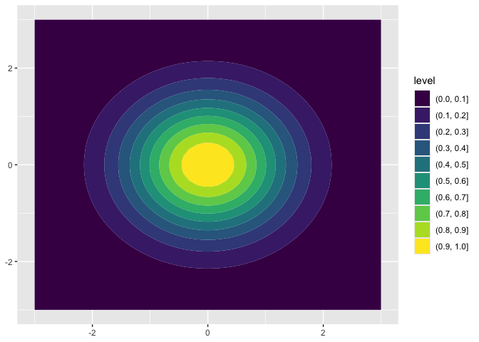<!-- -->

### Vector fields ($\mathbb{R}^2 \to \mathbb{R}^2$)

Draw streamlines from a vector field.

``` r
f <- function(u) c(-u[2], u[1])
ggplot() +
  geom_function_2d_2d(fun = f, xlim = c(-1, 1), ylim = c(-1, 1))
```

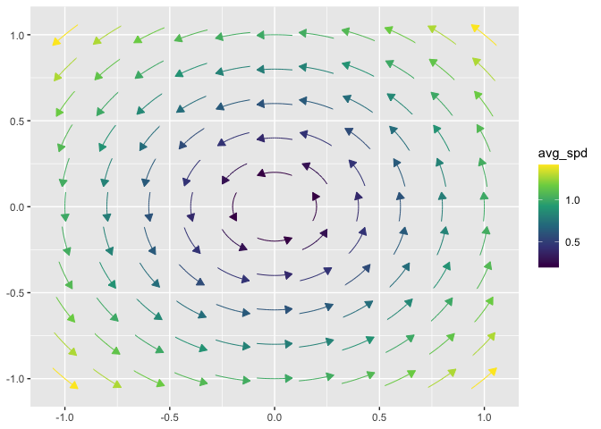<!-- -->

## Probability Distributions

### PDF

Shade below a quantile, between two quantiles, or shade the tails.

``` r
ggplot() +
  geom_pdf(fun = dnorm, xlim = c(-3, 3), p = 0.975, fill = "tomato")
```

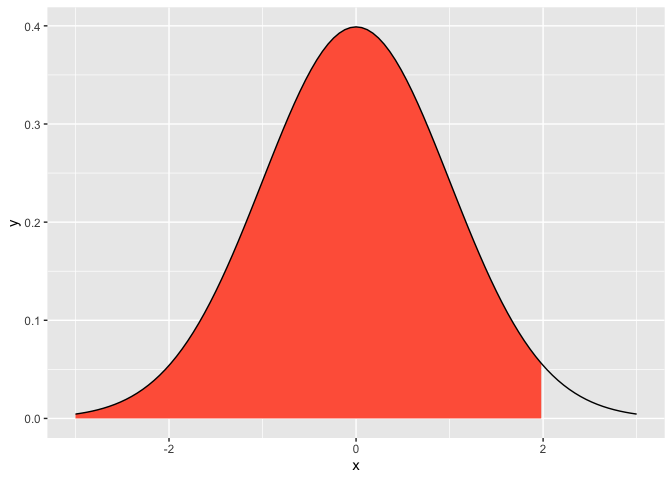<!-- -->

``` r
# Middle 95%
ggplot() +
  geom_pdf(fun = dnorm, xlim = c(-3, 3),
    p_lower = 0.025, p_upper = 0.975, fill = "steelblue")
```

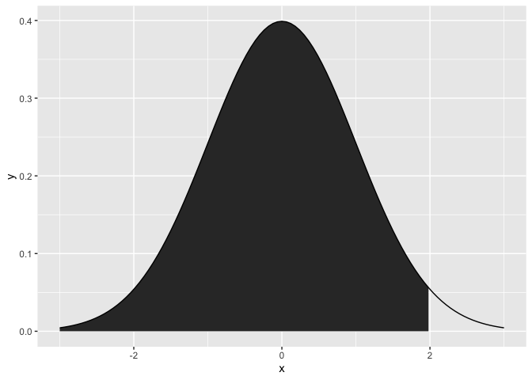<!-- -->

``` r
# Both tails
ggplot() +
  geom_pdf(fun = dnorm, xlim = c(-3, 3),
    p_lower = 0.025, p_upper = 0.975, shade_outside = TRUE, fill = "tomato")
```

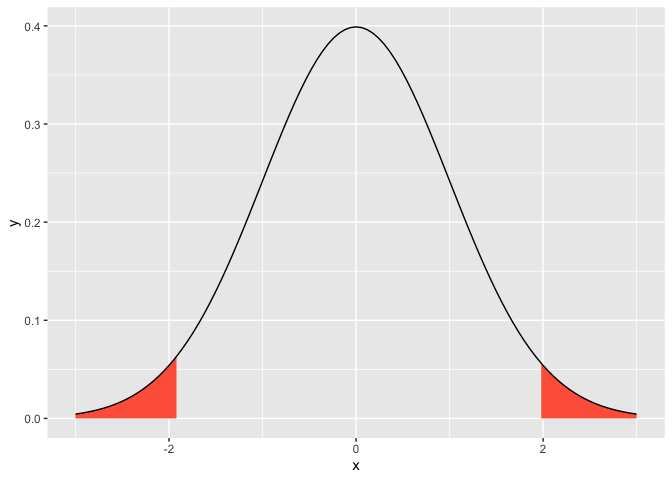<!-- -->

### CDF

``` r
ggplot() +
  geom_cdf(fun = pnorm, xlim = c(-3, 3), p = 0.975, fill = "darkgreen")
```

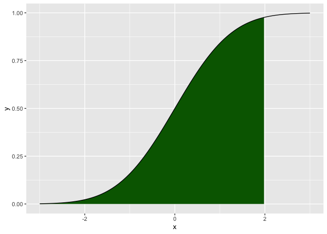<!-- -->

### PMF (lollipop)

``` r
ggplot() +
  geom_pmf(fun = dbinom, args = list(size = 10, prob = 0.3), xlim = c(0, 10))
```

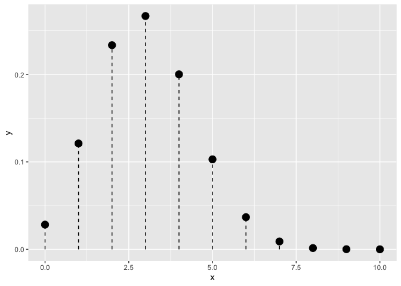<!-- -->

### Quantile function

``` r
ggplot() +
  geom_qf(fun = qnorm, args = list(mean = 0, sd = 1))
```

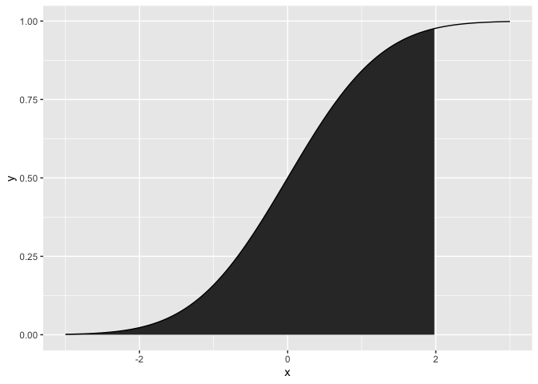<!-- -->

### Discrete CDF (step function)

``` r
ggplot() +
  geom_discrete_cdf(fun = dbinom, args = list(size = 10, prob = 0.5), xlim = c(0, 10))
```

<!-- -->

### Survival function

$S(x) = 1 - F(x)$

``` r
ggplot() +
  geom_survival(fun = pexp, args = list(rate = 0.5), xlim = c(0, 10))
```

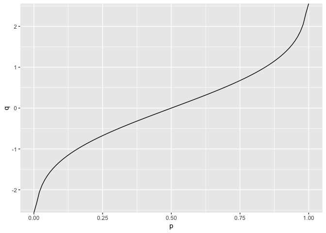<!-- -->

### Hazard function

$h(x) = f(x) / S(x)$

``` r
ggplot() +
  geom_hf(pdf_fun = dexp, cdf_fun = pexp, args = list(rate = 0.5), xlim = c(0.01, 10))
```

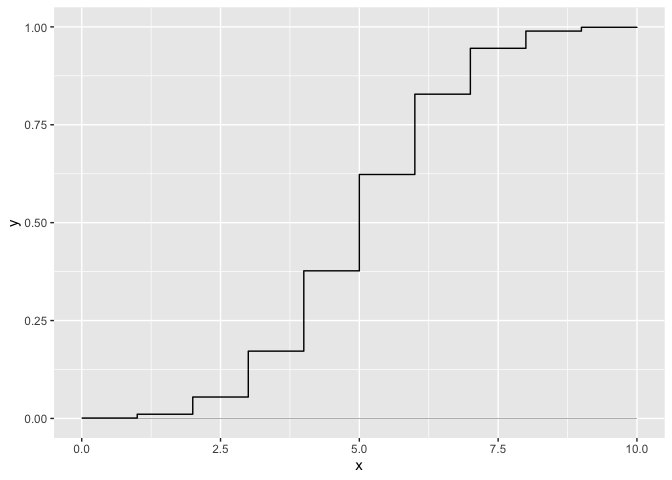<!-- -->

## Installation

``` r
# install.packages("pak")
pak::pak("dusty-turner/ggfunction")
```

## Getting help

- Browse the [vignette](vignettes/ggfunction.Rmd) for a guided
  walkthrough
- File bugs or feature requests at
  <https://github.com/dusty-turner/ggfunction/issues>
