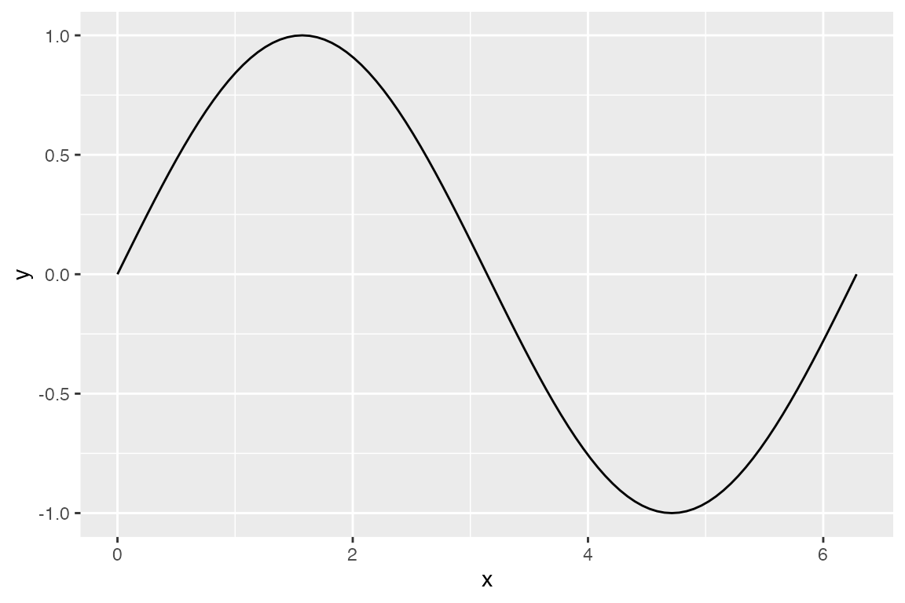
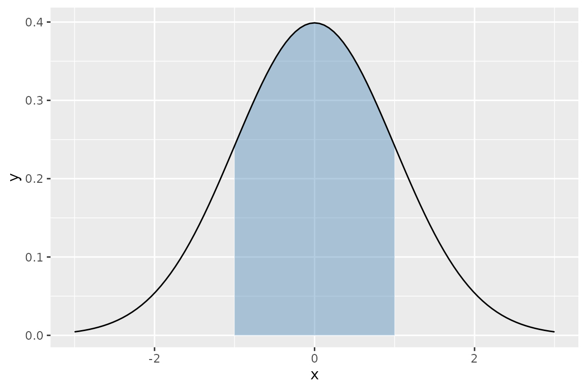
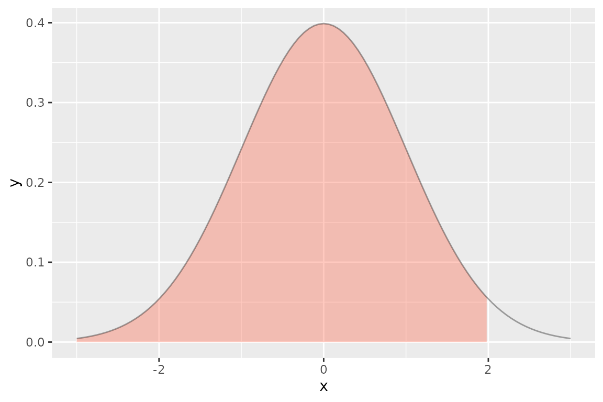
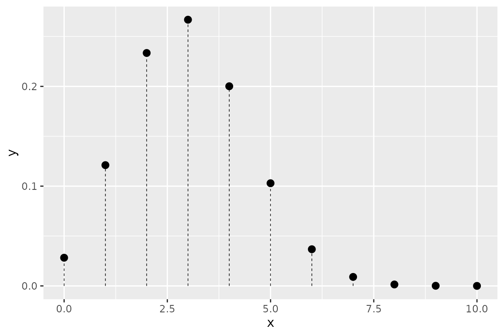
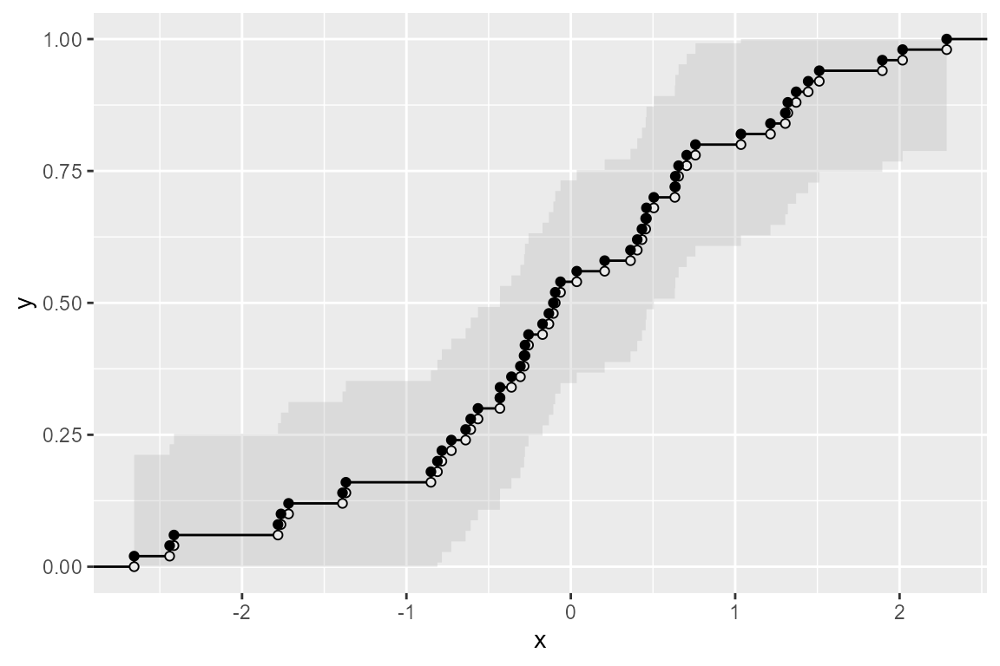
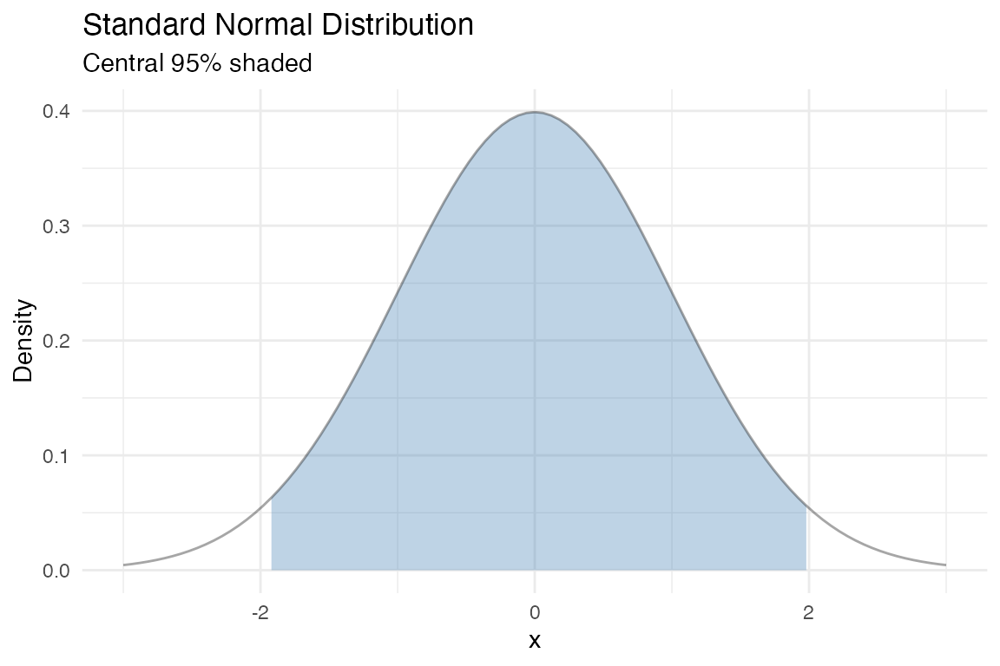

# Getting Started with ggfunction

## Installation

``` r
# Install from GitHub
pak::pak("dusty-turner/ggfunction")
```

## Your first plot

Pass any $\left. {\mathbb{R}}\rightarrow{\mathbb{R}} \right.$ function
and a domain:

``` r
ggplot() +
  geom_function_1d_1d(fun = sin, xlim = c(0, 2 * pi))
```



## Shading a region

Use `shade_from` and `shade_to` to highlight an interval under the
curve:

``` r
ggplot() +
  geom_function_1d_1d(
    fun = dnorm, xlim = c(-3, 3),
    shade_from = -1, shade_to = 1, fill = "steelblue"
  )
```



## Plotting a distribution

[`geom_pdf()`](/reference/geom_pdf.md) is purpose-built for density
functions. Use `p` to shade a cumulative probability region:

``` r
ggplot() +
  geom_pdf(fun = dnorm, xlim = c(-3, 3), p = 0.975, fill = "tomato")
```



## Discrete distributions

[`geom_pmf()`](/reference/geom_pmf.md) renders probability mass
functions as lollipop charts:

``` r
ggplot() +
  geom_pmf(
    fun = dbinom, xlim = c(0, 10),
    args = list(size = 10, prob = 0.3)
  )
```



## Working with data

[`geom_ecdf()`](/reference/geom_ecdf.md) builds an empirical CDF from
observed data, with an automatic Kolmogorov–Smirnov confidence band:

``` r
set.seed(42)
df <- data.frame(x = rnorm(50))

ggplot(df, aes(x = x)) +
  geom_ecdf()
```



## Layering with ggplot2

Every `ggfunction` geom is a standard ggplot2 layer. Add themes, titles,
and other geoms as usual:

``` r
ggplot() +
  geom_pdf(fun = dnorm, xlim = c(-3, 3),
           p_lower = 0.025, p_upper = 0.975,
           fill = "steelblue") +
  labs(
    title = "Standard Normal Distribution",
    subtitle = "Central 95% shaded",
    x = "x", y = "Density"
  ) +
  theme_minimal()
```


